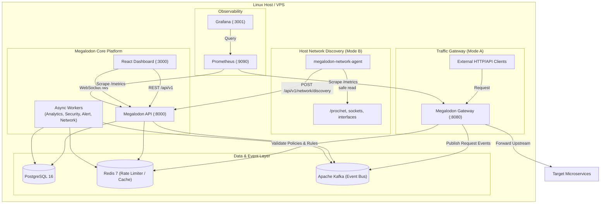
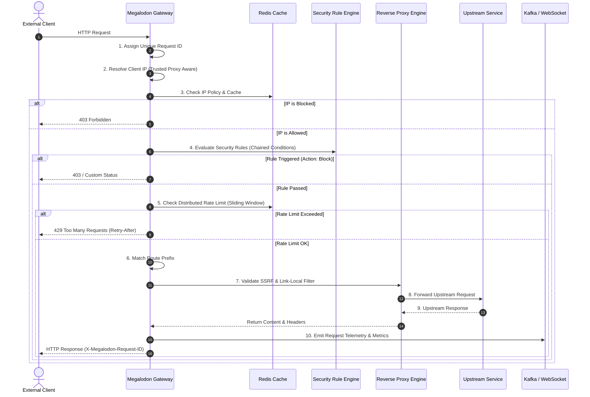

# Megalodon Architecture & System Design

Megalodon is an open-source, production-grade self-hosted API security, traffic management, and network visibility platform engineered to be deployed directly on a user's Linux server or VPS.

---

## 1. High-Level Architecture



---

## 2. Request Pipeline

Every HTTP request handled by the Megalodon Gateway traverses a 10-step zero-trust pipeline:



---

## 3. Host Network Discovery Architecture

```mermaid
flowchart LR
    subgraph HostKernel["Linux Kernel & Subsystems"]
        ProcNet["/proc/net (tcp, udp, route)"]
        ProcPid["/proc/<pid>"]
        Interfaces["Kernel Interfaces (eth0, docker0)"]
    end

    subgraph Agent["Megalodon Network Agent"]
        Collector["HostNetworkDiscoverer"]
        IfaceColl["InterfaceCollector"]
        SocketColl["SocketCollector"]
        ConnColl["ConnectionCollector"]
        ProcCorr["ProcessCorrelator"]

        Collector --> IfaceColl
        Collector --> SocketColl
        Collector --> ConnColl
        Collector --> ProcCorr
    end

    IfaceColl --> Interfaces
    SocketColl --> ProcNet
    ProcCorr --> ProcPid

    Agent -->|Continuous Loop (10s)| API["Megalodon API: /network/discovery"]
    API -->|Diff State| EventGen["Change Detection\n(PORT_OPENED, IFACE_ADDED)"]
    EventGen --> WS["WebSocket Dashboard Broadcast"]
```
